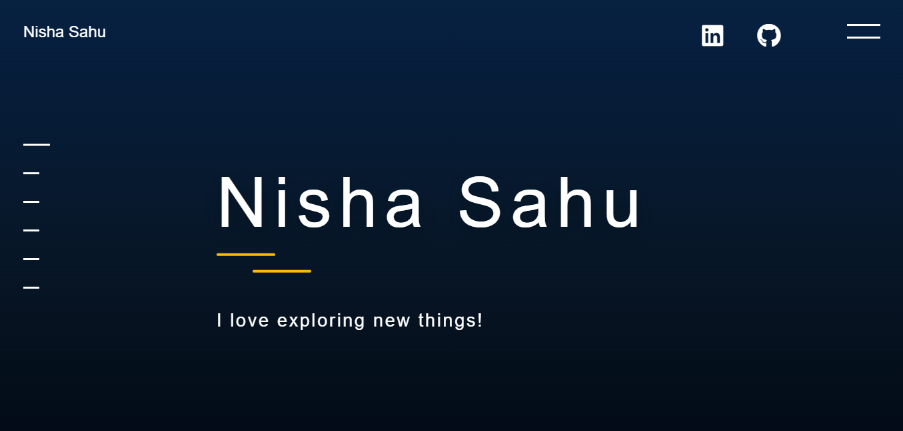

 
    </img>

<h1 align="center"> Nisha Sahu- Portfolio 🔥 </h1> 
<h3 align="center"> My Portfolio website </h3>

  # Personal Portfolio 🔥
>  https://nishasahuu.github.io/potfolio/

:star: Star me on GitHub.

### Website Preview
#### Home Page

#### About Page

#### Projects Page

  
## Features 📋
⚡️ Fully Responsive\
⚡️ Valid HTML5 & CSS3\
⚡️ Used JavaScript

## Sections 📚
✔️ About\
✔️ Education\
✔️ Skills \
✔️ Projects \
✔️ Resume\
✔️ Contact 

## Installation & Deployment 📦
- Clone the repository and modify the content of <b>index.html</b> 
- Add or remove images from `assets/img/` directory as per your requirement.
- Update the info of `projects` folder according to your need
- Use [Github Pages](https://create-react-app.dev/docs/deployment/#github-pages) to create your own website.
- To deploy your website, first you need to create github repository with name `<your-github-username>.github.io` and push the generated code to the `master` branch.

## Tools Used 🛠️
* <b>VsCode</b>
* <b>Github</b> 

# Technologies used 🛠️

- [HTML]
- [CSS]
- [JavaScript]
  

